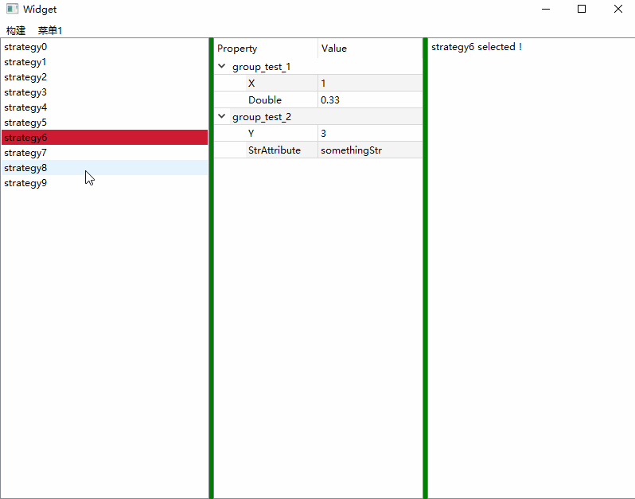

# Qt Clean Strategy Client

This software helps you control  those strategy on server,Its a simple and  clean GUI client, you can easily extend  the client to communicate with your strategy trader on server

Next To Do:
- Add network module
- Optimize the interface

Some screenshots of the Demo application:

# How to build
**Requirements:**

1. Qt 5.15 framework 

**To build:**
  
    mkdir path_to_build
    cd path_to_build
    qmake path_to_StrategyClient/StrategyClient.pro -r
    make

Or just open path\_to\_StrategyClient/StrategyClient.pro file in Qt Creator and build all.

